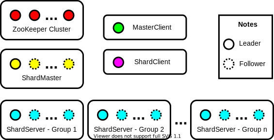
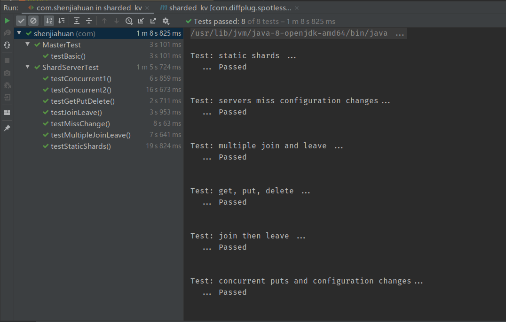
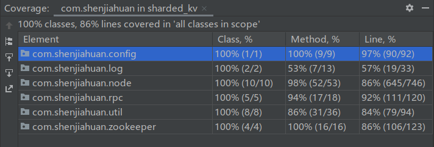

# 分布式KV Store

## 系统架构



整个系统由五个部分组成：

1. ZooKeeper 集群。ZooKeeper 集群一般由2n+1个节点构成，可以容忍n个节点的故障，超过n个节点故障后，系统将处于不可用状态。故障恢复后，系统将继续工作，数据持久性有保证。
2. ShardMaster。ShardMaster由n个节点构成，其中1个为主节点，其余n-1个为热备份节点，当主节点故障后其中一个节点自动切换为主节点进行工作。可以容忍n-1个节点的故障，当n个节点全部故障后，系统将处于不可用状态。故障恢复后，系统将继续工作，数据持久性有保证。
3. ShardServer。ShardServer分为n组，每组由m个节点构成（各组节点数可以不同），其中1个为主节点，其余m-1个为热备份节点，当主节点故障后其中一个节点自动切换为主节点进行工作。各组均可容忍m-1个节点的故障，当任意一组中m个节点全部故障时，部分数据将处于不可用状态（不可读写）。故障恢复后，系统将继续工作，数据持久性有保证。
4. MasterClient。MasterClient为单独的一台机器，可随时启动关闭。
5. ShardClient。ShardClient为单独的一台机器，可随时启动关闭。

特别地，可以取ZooKeeper集群中节点数为3，ShardMaster节点数为2，ShardServer由3个组构成，每个组节点数为2。

### ZooKeeper

ZooKeeper在本系统中起到两个作用：日志记录和领导者选举。

1. 日志记录

    ShardMaster和ShardServer是ZooKeeper的client，本地存有日志的一个快照和版本号。在试图添加日志时，尝试将新的日志拼接在本地日志快照的后面，并将新的日志和上一日志版本号发送给ZooKeeper集群。若中间有别的节点向ZooKeeper集群成功添加过日志，会导致版本号错误，本次添加失败，需要重试，若中间没有别的节点向ZooKeeper集群成功添加过日志，则ZooKeeper集群中的版本号和本地维护的版本号一致，添加成功。ZooKeeper的client会注册监听事件，监听ZooKeeper集群日志的变化，发生变化时：

    1. 更新本地日志快照和版本号
    2. 通知ShardMaster和ShardServer日志的新变更，因为此时新日志已在ZooKeeper集群中达成共识，可以更改本地状态。

    ZooKeeper的日志记录有效地保证了操作的可线性化，所有操作都按照记录日志的顺序执行，所有操作在所有节点的执行顺序一致。

2. 领导者选举

    由于ShardMaster和ShardServer都有leader和follower的概念，所以需要通过领导者选举算法选出领导者。选举过程可以利用ZooKeeper进行。

    选举过程如下：

    1. 每个节点启动时，在ZooKeeper集群中创建一个EPHEMERAL_SEQUENTIAL的znode，这一节点的特性为序号顺序增长，断开后znode自动消失。
    2. 节点创建完znode后，读取目录下所有的znode，
        1. 若本节点创建的znode是编号最小的，则自己是leader。
        2. 若本节点创建的znode不是编号最小的，则监听比自己编号小且最接近的znode，当该znode离开时，重新读取目录下所有znode并检查。

### ShardMaster

系统中数据以shard为粒度进行划分，预先指定所有数据根据key的哈希值取模划分为N个shard，一个组负责若干shard，一个shard只属于一个组。

ShardMaster在系统中负责配置管理，主要是指派各组ShardServer负责的shard。当MasterClient通知ShardMaster：

1. 有一个组加入时，找当前提供服务的组中，负责shard最多的组，分一半的shard给新的组。
2. 有一个组离开时，找当前提供服务的组中，负责shard最少的组，把离开的组负责的shard给这个组。

在更新配置时，旧版本的配置信息仍然需要保留。

ShardMaster还可相应MasterClient的查询请求，查询时，需带上查询的版本号，若版本号为-1，则查询最新配置。

为保证可线性化，除查询旧版本配置信息外，所有查询、加入、离开操作，都需要先写log到ZooKeeper集群，等ZooKeeper集群达到consensus后，操作方可进行。

### ShardServer

ShardServer在系统中负责实际数据存储。为保证原子性，以下操作均需要锁。

1. 版本管理

    ShardServer需要获取当前ShardMaster中的版本，当版本发生变化时，ShardServer可能需要更改自己负责的shard。

    ShardServer被设计为leader定时向ShardMaster查询新版本信息，当获取到新版本后，写入日志，一方面保证可线性化，另一方面起到通知follower的作用。

2. 响应GET/PUT/DELETE请求

    所有请求到来时，先向ZooKeeper集群写日志，并等待ZooKeeper日志更新通知，在日志更新后，会有真正的处理逻辑，并将结果返回。

3. 从其他节点获取数据

    每一组中，leader节点定时检查是否有需要从其他组拉取的数据（下文将介绍如何寻找需要拉取哪些数据）。通过历史配置信息可知道数据位于哪个组，发RPC向该组获取数据后，向ZooKeeper集群写日志，并等待ZooKeeper日志更新通知，在日志更新后，会有更新本地KV数据的操作。

4. ZooKeeper日志更新通知响应
    1. GET请求日志

        出现以下情况时，告诉client，该key不属于本组，要求client重试：

        1. Client声明要读的版本与当前版本不一致
        2. 该key确实在当前版本中不属于本组
        3. 数据在迁移过程中，仍有数据未到达本节点

        其余情况下，将从本节点内存中维护的KV数据中取出key对应的value，如果key不存在，需要告知client。

    2. PUT/DELETE请求日志

        与GET请求一致，上述三种情况下需要告诉client，该key不属于本组，要求client重试。

        由于PUT和DELETE请求非幂等操作，重发可能导致故障，因此需要记录每个client当前的请求序号，如果该序号已经处理过，则忽略该请求。

        其余情况下，将修改内存中维护的KV数据，进行PUT或DELETE操作。

    3. 版本变更日志

        在遇到版本变更时，若新的版本号高于当前版本号，需要进行处理：

        1. 将当前配置信息加入历史配置信息。
        2. 找出原先不属于当前组管理，新版本属于当前组管理的shard，等待从其他组获取。
        3. 找出原先属于当前组管理，新版本不属于当前组管理的shard，从当前内存中KV里移除，移到暂存区，等待其他组读取。
            1. 特殊情况：例如某一shard先从group 1迁移到group 2，再从group 2迁移到group 3，第二步操作时，group 2中尚未获取到shard的数据（还未从group 1中获取到），此时需要记录，当从group 1中获取到之后，立即加入暂存区。

            同时为防止迁移造成的非幂等，每个client执行过的请求序号需要也移到暂存区。

    4. 数据拉取日志

        若拉取的版本比当前版本小，需要进行处理：

        1. 从等待队列中移除等待的shard。
        2. 处理上文特殊情况中记录需要立即加入暂存区的数据。
        3. 将拉取的KV合并到本地内存中的KV。
        4. 将client执行过的请求序号合并到本地。
5. 响应其他节点的拉取请求

    若请求在暂存区中存在，将结果返回。若不存在且上文特殊情况发生，需等待本节点拉取数据后再进行响应。

### MasterClient

MasterClient在系统中充当两部分角色：

1. 用于获取MasterServer中的配置信息，这一配置信息在ShardServer和ShardClient中都需要用到，因此ShardServer和ShardClient会包含一个MasterClient。
2. 用于控制ShardServer组的加入和离开，相当于管理员功能。

### ShardClient

ShardClient是系统的用户，拥有一个交互式的环境，可以向ShardServer发送GET/PUT/DELETE请求。

发送请求前，ShardClient先向MasterServer读一个配置信息，并根据其寻找key负责的组，组中随机挑选一个节点向其发送请求。

MasterClient和ShardClient都要直接处理Server的异常返回（请求超时、当前节点非leader、key不属于当前组管辖），处理方式根据异常的类型，可能为向MasterServer重新获取更新的配置、向组中其他节点发送请求等。

### 架构特点

1. 强一致性

    由于操作都需要先向ZooKeeper写日志，待ZooKeeper通知后方可进行，故所有节点的操作顺序就是ZooKeeper的日志记录顺序，强一致性得以保证。

2. 可用性

    系统不存在单点故障问题，任意组件都可通过增加冗余的方法提高可用性。但受制于强一致性，在节点更新配置等时间段内，存在不可提供服务的窗口期。

3. 容错性

    系统可以容忍由网络不稳定（网络包丢包、重发、乱序、毁坏）造成的问题。

4. 负载均衡

    数据在节点之间可进行移动，当节点加入和删除后，算法可尽量保证各节点存储数据量近似相等，且移动数据较少。

5. 可扩展性

    ShardServer可以动态增加或减少，系统的可扩展性较好。

## 系统测试、部署与运行

### 运行环境

本系统依赖的软件环境和第三方库如下：

| 名称                 | 版本     | 需要手动安装 |
| -------------------- | -------- | ------------ |
| Ubuntu               | 18.04    | ☑️            |
| IntelliJ IDEA        | 2020.1.2 | ☑️            |
| Maven                | 3.6.0    | ☑️            |
| OpenJDK              | 1.8      | ☑️            |
| Docker               | 18.09.7  | ☑️            |
| ZooKeeper            | 3.6      |              |
| Gson                 | 2.8.6    |              |
| gRPC                 | 1.29.0   |              |
| JUnit                | 5.6.1    |              |
| Argparse4j           | 0.8.1    |              |
| Apache Commons Codec | 1.14     |              |

标明需要手动安装的项，是用于开发环境中的，其余项目或是由包管理工具（Maven）自动配置，或是集成到了Docker容器中。

### 测试流程

为测试系统功能，编写了若干测试用例，以下功能均可通过测试，且在模拟网络包存在丢包、重发、乱序、毁坏情况下，仍可以通过测试。

1. MasterServer
    1. ShardServer 组加入、离开后，配置信息能正确更新。
    2. 历史版本信息能正确获取。
    3. 并行的加入、离开能正确响应。
2. ShardServer
    1. 插入、删除、查询能正确处理。
    2. 组加入后，数据能被均匀地分布在各组之间。
    3. 某个组的所有机器全部突然故障（未安全地离开），该组的数据将处于不可用状态，其他数据仍然可以响应；重启后，数据恢复响应。
    4. 组加入或离开后，数据可进行移动。
    5. leader故障后，会有follower自动晋升为leader提供响应。
    6. 并行的查询和插入，伴随频繁的配置更新（组间数据移动），可以正常提供响应。

测试时，使用多线程模拟多节点，即每个MasterServer、ShardServer、MasterClient、ShardClient各创建一个线程（当然，其自身会按需创建其他后台线程等），且这些线程之间使用同样的RPC逻辑进行通信。

每次执行测试时，会先使用一个初始化脚本清空ZooKeeper中的数据（已集成在ZooKeeper容器中）。

### 执行测试

部署测试环境时，需要用到自行打包的zookeeper容器，打包方式见“系统部署”部分。

1. 启动ZooKeeper集群

    在项目根目录下，执行：

    ```bash
    ./zk_testenv.sh
    ```

    该脚本会创建三个ZooKeeper容器组成集群，分别将2181端口映射到宿主机的21811、21812、21813端口。

2. 执行测试用例

    项目可使用IntelliJ IDEA运行测试用例（也可使用Maven执行测试，此处略），结果如下：

    

3. 测试覆盖率

    使用IntelliJ IDEA执行测试用例，展示的覆盖率如下（忽略了gRPC 生成的桩代码的覆盖率）：

    

### 系统部署

本系统采用Docker进行部署，在`docker` 目录下分别有ZooKeeper的Dockerfile和ShardKV的Dockerfile（MasterServer、ShardServer、MasterClient、ShardClient四合一）。

1. ZooKeeper

    在 `docker/zookeeper`目录下，执行：

    ```bash
    docker build . -t shenjiahuan:zookeeper
    ```

    将生成ZooKeeper的docker镜像。

    镜像制作有如下说明：

    1. 镜像以Ubuntu 18.04为base制作。
    2. 镜像中安装了OpenJDK8的JRE，用于支撑ZooKeeper的运行。
    3. 镜像从Apache下载了指定版本（3.6.1）的ZooKeeper，并解压到了特定位置。
    4. `docker-entrypoint.sh`和`reset.sh`被分别拷贝到了镜像中，前者用作ZooKeeper启动脚本，其中包括ZooKeeper的初始化逻辑，和根据环境变量设置ZooKeeper集群中包含的实例；后者用作ZooKeeper的数据清空脚本，在测试中用到。
2. ShardKV
    1. 通过以下指令编译出jar包：

        ```bash
        mvn compile assembly:single
        ```

    2. 将`target/sharded_kv-1.0-SNAPSHOT.jar`拷贝到`docker/kv`下。
    3. 在`docker/kv`目录下，执行：

        ```bash
        docker build . -t shenjiahuan:kv
        ```

        将生成ShardKV的docker镜像。

        镜像制作有如下说明：

        1. 镜像以Ubuntu 18.04为base制作。
        2. 镜像中安装了OpenJDK8的JRE，用于支撑ShardKV的运行。
        3. `sharded_kv-1.0-SNAPSHOT.jar`被拷贝到了镜像中。
        4. 镜像启动时，会自动运行`sharded_kv-1.0-SNAPSHOT.jar`。

### 运行

在`docker/kv`目录下，执行`run.sh`，该脚本执行如下操作：

1. 建立一个docker network，之后所有容器都将加入此虚拟网络。
2. 创建三个ZooKeeper实例。
3. 调用初始化脚本对ZooKeeper的znode进行初始化。
4. 创建两个MasterServer实例。
5. 创建3组SharServer，每组2个实例。
6. 调用MasterClient，将三组ShardServer注册到MasterServer。
7. 调用ShardClient，进入交互式环境，可响应以下请求：
    1. `get <key>`
    2. `put <key> <value>`
    3. `delete <key>`

### 系统功能演示

为演示系统功能，制作了演示视频：[https://www.bilibili.com/video/BV12A411i7rZ/](https://www.bilibili.com/video/BV12A411i7rZ/)，演示内容包括：

1. 系统环境部署
2. 数据的增删查
3. ShardServer的动态增加、减少
4. MasterServer和ShardServer的异常宕机

### Q&A

1. **Q:** ZooKeeper在系统中用于存放Log，所有节点的Log全部存在同一个ZooKeeper集群中，没有分散存放，导致ShardServer做Shard的意义不大？

    **A:** 系统设计时考虑到了这一问题，这一问题不需要更改代码即可解决：事实上，ShardMaster、ShardServer的每个组高度自治，他们并不同享同一份Log，即各自记各自的Log。因此完全可以在部署的时候创建多个ZooKeeper集群，ShardMaster使用一个ZooKeeper集群，各个ShardServer的组使用一个集群，这样，Log便和数据一样分开了。

### 系统展望与进一步工作

1. 提升读请求的性能。目前的设计中，每个读请求都需要先向ZooKeeper集群中写Log，等待成功后，读请求才会发生，这一设计导致读的性能不太理想。参考论文[Viewstamped Replication Revisited](http://pmg.csail.mit.edu/papers/vr-revisited.pdf)中6.3节的设计，可以使得读请求不需要写Log，读请求性能能够大幅提升。
2. Log 清理。随着时间的推移，ZooKeeper中存放的Log会越来越多，导致读写性能存在问题，且ZooKeeper集群的ZooKeeper空间容易被撑满。目前的设计中，ZooKeeper中的Log无法清理（即使Log的操作已经被所有需要被更新的节点更新），因为目前，MasterServer和ShardServer并不持久化存储数据，导致其宕机后需要从ZooKeeper读取所有Log并重做。如果在MasterServer和ShardServer中添加一层持久化存储，则当每一负责节点都将某一时间的数据写到持久化存储后，可以创建一个检查点，检查点前的Log可以从ZooKeeper中清空。